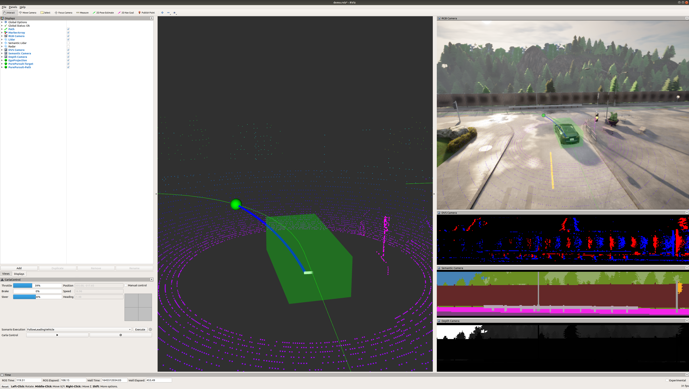
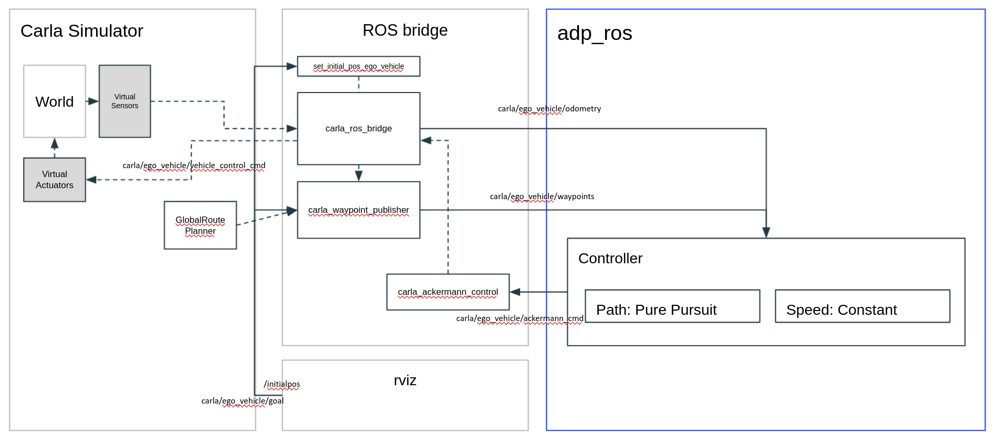

# adp_ros (Autonomous Driving Planner) v0.0.1

This software stack was created to play a role as "Hello World" of autonomous driving planning software.





## Features
* Lane following with constant velocity
	* Take waypoints published by Carla simulator as reference path
	* Apply Pure Pursuit method to track the reference 
	* As Ego vehicle is sufficiently close to the goal (last waypoint), target zero velocity
	
# Dependencies
* [Carla simulator](https://carla.readthedocs.io/en/latest/start_quickstart/)
* [ROS (Robot Operating System)](http://wiki.ros.org/melodic/Installation/Ubuntu)
* [Carla-ros bridge](https://github.com/carla-simulator/ros-bridge)

# Demo
```
cd /opt/carla-simulator
./CarlaUE4.sh -windowed -ResX=120 -ResY=90
```
In another terminal, launch `demo_with_scenario.launch`
```
cd ~/workspace/adp_ros/src/demo/launch
roslaunch demo_with_scenario.launch
```
In another terminal, run `controller` package
```
rosrun controller controller
